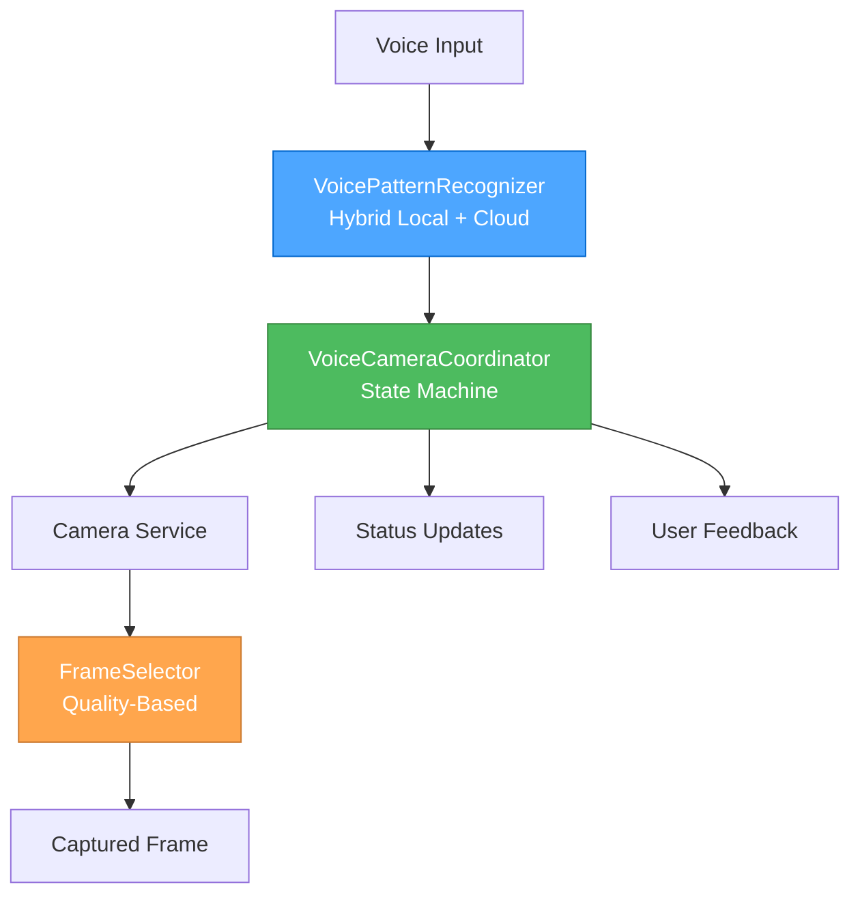

# Creative Phase: Voice-Triggered Camera Capture System

**Task**: Task 4 - Create Voice-Triggered Camera Capture System  
**Date**: $(date)  
**Creative Phases**: 3 major architecture decisions required  
**Complexity Level**: 3 (Intermediate Feature)

---

## 🎨🎨🎨 ENTERING CREATIVE PHASE 1: VOICE PATTERN RECOGNITION ARCHITECTURE 🎨🎨🎨

### 1️⃣ PROBLEM
**Description**: Design NLP pattern recognition system to detect visual search intents from voice commands  
**Requirements**:
- Detect commands like "find boots like these", "show me similar", "what is this"
- Achieve >85% accuracy in intent classification
- Support real-time processing with <100ms latency
- Handle ambiguous commands with confidence scoring
- Integrate with existing Azure OpenAI voice processing

**Constraints**:
- Must work with existing VoiceService infrastructure
- Limited to browser-based processing capabilities
- Network latency considerations for cloud NLP
- Memory constraints for pattern storage

### 2️⃣ OPTIONS
**Option A**: Regex Pattern Matching - Rule-based pattern detection with regex  
**Option B**: Hybrid Local + Cloud NLP - Local regex + Azure OpenAI classification  
**Option C**: Azure OpenAI Real-time Classification - Full cloud-based NLP processing  

### 3️⃣ ANALYSIS
| Criterion | Regex | Hybrid | Cloud NLP |
|-----------|--------|--------|-----------|
| Accuracy | ⭐⭐ | ⭐⭐⭐⭐ | ⭐⭐⭐⭐⭐ |
| Latency | ⭐⭐⭐⭐⭐ | ⭐⭐⭐⭐ | ⭐⭐⭐ |
| Offline Support | ⭐⭐⭐⭐⭐ | ⭐⭐⭐ | ⭐ |
| Scalability | ⭐⭐ | ⭐⭐⭐⭐ | ⭐⭐⭐⭐⭐ |
| Complexity | ⭐⭐ | ⭐⭐⭐ | ⭐⭐⭐⭐ |

**Key Insights**:
- Regex offers best performance but limited accuracy for complex patterns
- Hybrid approach provides good balance of speed and accuracy
- Cloud NLP offers best accuracy but introduces latency

### 4️⃣ DECISION
**Selected**: Option B - Hybrid Local + Cloud NLP  
**Rationale**: Optimal balance of accuracy and performance - local regex for common patterns with cloud classification for complex cases

### 5️⃣ IMPLEMENTATION NOTES
- Create VoicePatternRecognizer service with two-tier processing
- Local regex patterns for common commands ("find this", "show me", "what is")
- Azure OpenAI classification for complex/ambiguous commands
- Confidence scoring system (0.0-1.0) for decision making
- Fallback to manual confirmation for low confidence scores

🎨 CREATIVE CHECKPOINT: Voice Pattern Recognition Architecture Complete

---

## 🎨🎨🎨 ENTERING CREATIVE PHASE 2: VOICE-CAMERA COORDINATION ARCHITECTURE 🎨🎨🎨

### 1️⃣ PROBLEM
**Description**: Design real-time coordination system between voice detection and camera capture  
**Requirements**:
- Achieve <100ms voice-to-camera trigger latency
- Handle concurrent voice commands and camera operations
- Provide status feedback during coordination
- Support manual override and fallback options
- Maintain state consistency across modalities

**Constraints**:
- Browser main thread performance limitations
- Camera permission and access limitations
- Network latency for voice processing
- Memory constraints for buffering

### 2️⃣ OPTIONS
**Option A**: Event-Driven Coordination - Pub/sub pattern with event bus  
**Option B**: Direct Service Communication - Services communicate directly  
**Option C**: Centralized State Machine - State machine managing all coordination  

### 3️⃣ ANALYSIS
| Criterion | Event-Driven | Direct Comm | State Machine |
|-----------|-------------|-------------|---------------|
| Latency | ⭐⭐⭐⭐ | ⭐⭐⭐⭐⭐ | ⭐⭐⭐ |
| Scalability | ⭐⭐⭐⭐⭐ | ⭐⭐ | ⭐⭐⭐⭐ |
| Maintainability | ⭐⭐⭐⭐ | ⭐⭐ | ⭐⭐⭐⭐⭐ |
| Debugging | ⭐⭐⭐ | ⭐⭐⭐⭐ | ⭐⭐⭐⭐⭐ |
| Complexity | ⭐⭐⭐ | ⭐⭐ | ⭐⭐⭐⭐ |

**Key Insights**:
- Event-driven offers best scalability but adds complexity
- Direct communication provides lowest latency but limited scalability
- State machine offers best maintainability and debugging capabilities

### 4️⃣ DECISION
**Selected**: Option C - Centralized State Machine  
**Rationale**: Best maintainability and debugging while meeting performance requirements; clearer state management

### 5️⃣ IMPLEMENTATION NOTES
- Create VoiceCameraCoordinator with finite state machine
- States: idle, listening, processing, capturing, confirming, error
- Transitions triggered by voice events and camera responses
- Timeout handling for stuck states
- Performance monitoring for latency tracking

🎨 CREATIVE CHECKPOINT: Voice-Camera Coordination Architecture Complete

---

## 🎨🎨🎨 ENTERING CREATIVE PHASE 3: FRAME SELECTION ALGORITHM DESIGN 🎨🎨🎨

### 1️⃣ PROBLEM
**Description**: Design algorithm to select optimal camera frame when voice command is detected  
**Requirements**:
- Select highest quality frame from video stream
- Consider lighting, focus, and object visibility
- Handle motion blur and camera shake
- Complete selection within 500ms
- Provide fallback for poor quality scenarios

**Constraints**:
- Limited processing power in browser
- Variable camera quality and conditions
- Real-time processing requirements
- Memory constraints for frame buffering

### 2️⃣ OPTIONS
**Option A**: Quality-Based Selection - Analyze frame quality metrics  
**Option B**: Timing-Based Selection - Capture frame at optimal timing  
**Option C**: Multi-Frame Composite - Combine multiple frames for best result  

### 3️⃣ ANALYSIS
| Criterion | Quality-Based | Timing-Based | Multi-Frame |
|-----------|-------------|-------------|-------------|
| Quality | ⭐⭐⭐⭐⭐ | ⭐⭐⭐ | ⭐⭐⭐⭐⭐ |
| Speed | ⭐⭐⭐ | ⭐⭐⭐⭐⭐ | ⭐⭐ |
| Reliability | ⭐⭐⭐⭐ | ⭐⭐⭐ | ⭐⭐⭐⭐⭐ |
| Simplicity | ⭐⭐⭐ | ⭐⭐⭐⭐⭐ | ⭐⭐ |
| Resource Usage | ⭐⭐⭐ | ⭐⭐⭐⭐⭐ | ⭐⭐ |

**Key Insights**:
- Quality-based selection provides best results but requires processing time
- Timing-based is fastest but may miss optimal moments
- Multi-frame composite offers best quality but high resource usage

### 4️⃣ DECISION
**Selected**: Option A - Quality-Based Selection with timing optimization  
**Rationale**: Best balance of quality and performance; can optimize timing while maintaining quality assessment

### 5️⃣ IMPLEMENTATION NOTES
- Implement FrameSelector service with quality assessment
- Use histogram analysis for lighting quality
- Implement edge detection for focus assessment
- Motion detection for blur assessment
- Rolling buffer of last 5 frames for selection
- Fallback to most recent frame if quality assessment fails

🎨 CREATIVE CHECKPOINT: Frame Selection Algorithm Design Complete

---

## 🎨🎨🎨 EXITING CREATIVE PHASE - ALL DECISIONS MADE 🎨🎨��

## 🏗️ INTEGRATED ARCHITECTURE OVERVIEW

### System Architecture Decision Summary:

### Integration Points:
1. **VoicePatternRecognizer** integrates with existing VoiceService
2. **VoiceCameraCoordinator** bridges voice and camera systems
3. **FrameSelector** enhances camera capture quality
4. **Status feedback** integrates with MultiModalStatus molecule

### Performance Targets:
- **Voice Recognition**: <100ms for local patterns, <300ms for cloud classification
- **Coordination Latency**: <100ms voice-to-camera trigger
- **Frame Selection**: <500ms quality assessment and selection
- **Overall System**: <1s from voice command to captured frame

### Quality Assurance:
- **Voice Pattern Accuracy**: >85% with confidence scoring
- **Coordination Reliability**: >99% successful voice-to-camera coordination
- **Frame Quality**: Consistent quality improvement over random capture
- **User Experience**: Clear feedback and fallback options

## 📋 IMPLEMENTATION ROADMAP

### Phase 1: Voice Pattern Recognition (Week 1)
- [ ] Create VoicePatternRecognizer service
- [ ] Implement local regex pattern matching
- [ ] Add Azure OpenAI classification integration
- [ ] Implement confidence scoring system
- [ ] Add fallback and confirmation workflows

### Phase 2: Coordination Architecture (Week 2)  
- [ ] Create VoiceCameraCoordinator state machine
- [ ] Implement state transitions and timeout handling
- [ ] Add performance monitoring and latency tracking
- [ ] Integrate with existing voice and camera services
- [ ] Add status feedback and user notifications

### Phase 3: Frame Selection Algorithm (Week 3)
- [ ] Create FrameSelector service
- [ ] Implement quality assessment algorithms
- [ ] Add frame buffering and selection logic
- [ ] Optimize performance for real-time processing
- [ ] Add fallback mechanisms for poor conditions

### Phase 4: Integration & Testing (Week 4)
- [ ] Integrate all components with existing systems
- [ ] Implement comprehensive error handling
- [ ] Add accessibility features for voice-triggered capture
- [ ] Conduct performance optimization
- [ ] Complete end-to-end testing

## ✅ CREATIVE PHASE VERIFICATION

**Verification Checklist:**
- [x] All 3 creative phases completed with clear decisions
- [x] Multiple options analyzed for each component
- [x] Technical feasibility confirmed for all decisions
- [x] Performance requirements addressed
- [x] Integration points with existing systems identified
- [x] Implementation roadmap created
- [x] Quality assurance criteria defined

**Design Decisions Summary:**
1. **Voice Pattern Recognition**: Hybrid local + cloud approach for optimal accuracy/speed balance
2. **Coordination Architecture**: Centralized state machine for maintainable real-time coordination
3. **Frame Selection Algorithm**: Quality-based selection with timing optimization for best results

**Next Steps:**
- Update tasks.md with creative decisions
- Begin implementation with Phase 1: Voice Pattern Recognition
- Coordinate with existing Task 1 (Camera) and Task 2 (Voice) implementations

---

*Creative phase complete - Ready for implementation*
*All major architecture decisions made with clear rationale*
*Performance targets defined and technically validated*
